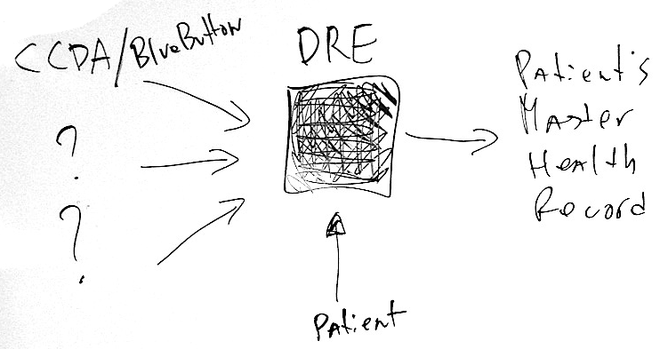
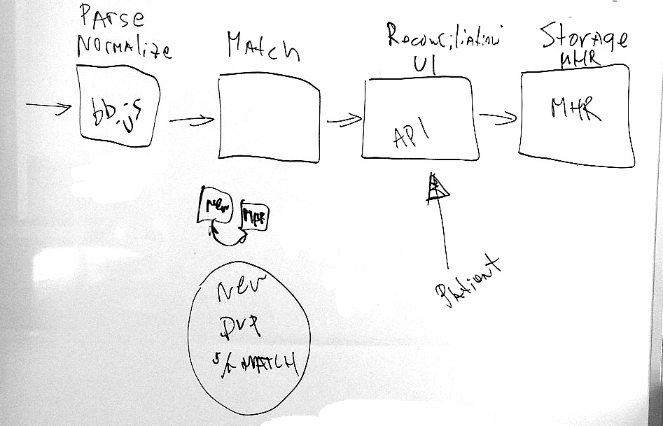

Raccoon
=========

Raccoon is a node.js Data Raccoonciliation Engine for Health Data.

[](https://travis-ci.org/amida-tech/Raccoon)


High Level Overview
===================


Purpose of Data Raccoonciliation Engine is to take personal health data in variety of formats (starting with BlueButton/CCDA) from multiple sources and parse/normalize/de-duplicate/merge it into single Patient's Master Health Record with patient's assistance (thou, most of hard work will be done automagically).


Racoon's components
=================


Raccoon has 4 primary elements

#### 1 - Parsing and Normalization Library.

This parses incoming data into a homogenous, simplified data model.  Currently, this is served by bluebutton.js; however this will be refactored into a more efficient, server-only model.

#### 2 - Matching Library.

This takes the standardized data elements and flags probable duplicates values. New patient's records are compared against existing Master Health Record and automatically matched with result produced as all elements of a new record are flagged as duplicates, new and % of match (to be reconciled by patient in a next step).

#### 3 - Reconciliation Interface.

This provides a RESTful API for review and evaluation of duplicates.

#### 4 - Master Record Interface.

This provides a RESTful API for interaction with and access to the aggregated health record.

Components Documentation
========================

Matching Library
----------------
match.js

This library exposes methods for matching entire health records as well as lower level methods for matching sections of health records.

Document matching method

```
var match = require('./lib/match.js').match;
match(bb_new_record, bb_master_health_record);
```

Example of matching entire records.

```
var fs = require('fs');
var BlueButton = require('./lib/bluebutton.min.js');
var match = require('./lib/match.js').match;

var xml = fs.readFileSync('test/records/ccda/CCD.sample.xml', 'utf-8');
var src_bb = dest_bb = new BlueButton(xml);

//compare record to itself (should be perfect match)
match(src_bb, dest_bb);
```

This will produce following match object:
```javascript
{
    "match":
    {
        "allergies" : [
            { "src_id" : 0, "dest_id" : 0, "match":"duplicate" },
            { "src_id" : 1, "dest_id" : 1, "match":"duplicate" },
            { "src_id" : 2, "dest_id" : 2, "match":"duplicate" },
            ...
            }
        ],
        "medications" : [...],
        "demographics" : [...]
        ...
    }
}
```


Match element can be `{"match" : "duplicate"}`, `{"match" : "new"}` or `{"match" : "partial", "percent": 50}`, partial match is expressed in percents and can range from `1` to `99`. Element attribute `dest_id` refers to element position (index) in related section's array of master health record. Element attribute `src_id` refers to element position (index) in related array of document being merged (new record).

```javascript
{
    "match":
    {
        "allergies" : [
            { "match" : "duplicate", "src_id" : 0, "dest_id": 2 },
            { "match" : "new", "src_id" :1 },
            { "match" : "partial", "percent" : 50, "src_id" : 2, "dest_id" : 5},
            ...
            }
        ],
        "medications" : [...],
        "demographics" : [...]
        ...
    }
}
```

Database Access
---------
record.js

This is the layer for access to the actual database.  Currently only implemented for Mongo using Mongoose package.

API consists of four main methods to connect to/disconnnect from database, put master record and get master record.  Also provided
convenience methods to put and get individual sections.

`connect([uri], [options])`

Requests connections to the database and does the necessary initializations.  record.js raises three events to deal with connections:
`connected`, `error`, and `disconnected`.  Events are preferred as opposed to callbacks to provide applications access to errors after
connection is established such as power down.  record.js keeps track of the connection on the module level and you cannot connect or
disconnect multiple times. This alleviates the need for applications to keep track of the connection object.

uri is the address of the database and defaults to `mongodb://localhost/portal`.  options is included for customization and
testing purposes.  Currently only two fields are supported:

ownerTitle: This is a label internally used to identify database elements that stores owner specific info.  Defaults to `owner`
sectionTitles: This is an array of section titles in the master records.  Default to
`['demographics', 'allergies', 'encounters', 'immunizations',  'results', 'medications', 'problems', 'procedures', 'vitals']`.

These two fields are primarily being used for testing purposes where whole database elements (Mongo collections) can be dropped
without affecting anything outside record.js.  They also make it possible to change the list of supported sections without any code
change in record.js.

`disconnect()`

This ends the previously established connection.  It is expected to be called when application quits.

`putMaster(owner, input, [options], callback)`

This puts a master record (input) into the database.

"owner" is the key (String) for the owner of the master record.  It is the only field used to identify who the owner
of the master record.  It is also likely to be used as an index.

"input" is assumed to have fields each associated with a particular section. Each field is assumed to be in the form

input['demographics'] = {data: <any object>, metadata: <any object>}

and all other sections (allergies, demographics, etc.).  Other than this structure record.js does not assume anything
on the actual content of the data and metadata.  Anything that is passed in data and metadata fields are stored as BLOBS.

By default only those sections that has a key in "input" is updated.  You can set any section explicitly to null to remove
from the master record.

"options" is added for future customizations.  Currently only field that is supported is 'deleteMissing' which can be used
to delete all the sections that are not explicitly specified in `input`.

"callback" only returns a single error parameter.  Unlike other typical database update libraries it does not return
actual stored object so that any actual database dependency is limited to record.js.

`getMaster(owner, [options], callback)`

This gets a master record in the database.

`owner` is explained in putMaster.

By default all the sections in the master record is returned.  You can specify a subset by settings `sections` field
of `options` (for example `options.sections = ['demographics', 'medications']`).

`callback(error, result)` returns the result of the query.  The format of the result is identical to the input described
in putMaster.


In addition of the master record methods convenience section methods are alsa supplied

`putDemographics(owner, input, callback)`
`getDemographics(owner, callback)`

and similar for other sections.  For sections 'input' is in the form {data: <any object>, metadata: <any object>}.  The result is returned
in the same form in the get methods.


`dropAll(callback)`

A drop all method is provided to remove all the artifacts related to the master record from the database.  It is used in unit
tests.

Database Design
--------

record.js insulates the actual design of the database from the higher levels.  This summarizes some of those details.

Current implementation is based on MongoDB and almost exclusively use Mongoose package; only exception is dropping collections which
uses native MongoDB methods.  Each section in the master record gets its own collection (demographics, allergies, etc). For each collection
the schema is

`{owner: String, data: {}, metadata: {}}`

where there are no restrictions on the data and metadata objects.

owner in the section collections are not used for lookups.  Instead there is an additional owner collection with Schema

`{owner: String, demographics: ObjectId, medications: ObjectId, ...}`

and all owner look ups use this collection.  Currently all the section collection elements are removed immediately once they are
replaced by a new master record.  However the chosen database structure lends itself nicely to keep "zombie" section collection elements
around if we choose that route in the future.  Replaced sections can be transfered to an archive and or removed overnight batch process
to decrease load  during peak times.

